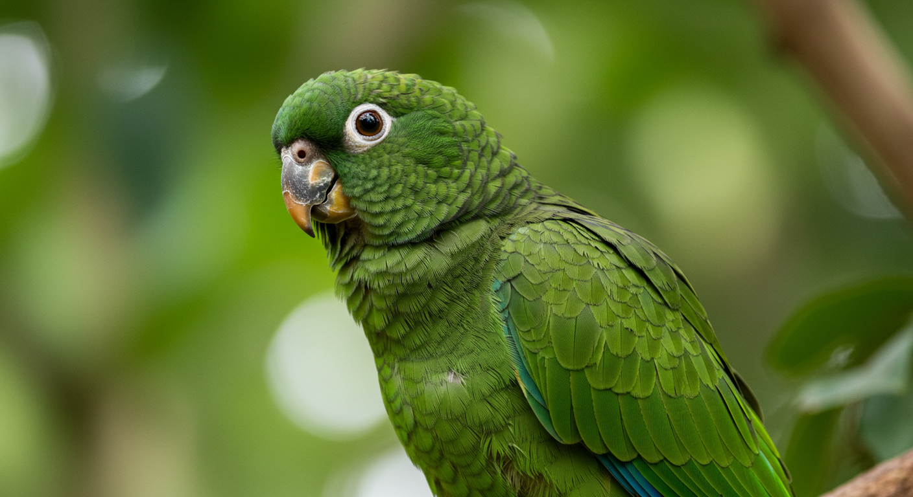

# Guia Prático para Designers: Geração de Imagens com IA

Este guia abrangente foi criado especificamente para designers que desejam dominar a arte de gerar imagens com IA, maximizando qualidade, relevância e aplicabilidade profissional.

---

Autor: Diogo Saucedo
github: [diogosaucedo](https://github.com/diogosaucedo)

## 1. Defina um Objetivo Claro

Antes de gerar qualquer imagem, defina claramente os requisitos. Este é o fundamento de um resultado bem-sucedido.

### Checklist de Planejamento

**Conteúdo e Conceito:**

- Qual é o tema ou assunto da imagem?
- Quais são os elementos essenciais que devem estar presentes?
- Há algum contexto ou história que a imagem deve contar?
- Há contexto racial, cultural ou geográfico que deve ser considerado?

**Aspectos Visuais:**

- Qual é o estilo ou atmosfera desejada (realista, abstrato, futurista, etc.)?
- Quais são as restrições de cor ou paleta?
- Quais são as emoções ou sentimentos que a imagem deve transmitir?
- Há alguma referência visual ou inspiração que você gostaria de usar?

**Especificações Técnicas:**

- Qual é o tamanho ou resolução necessária?
- Se for fotografia, qual iluminação é necessária?
- Há requisitos de câmera, lente ou ângulo de visão?
- Qual será o uso final (web, impressão, social media)?

### Exemplo de definição de objetivo

```markdown
Gere uma imagem de uma aestiva(papagaio verdadeiro) em um ambiente de floresta amazônica.. A imagem deve parecer ser uma fotografia tirada com uma lente de 50mm de uma maquina mirrorless. O papagaio deve estar posando em um galho, com folhas verdes ao fundo.
```

### Refinamento do Objetivo com IA

Use modelos como ChatGPT, Claude ou Gemini para refinar seus prompts. Forneça o esboço inicial e peça sugestões específicas.

```markdown
Faca o refinamento desse prompt de geração de imagem para o google image fx:
Gere uma imagem de uma aestiva(papagaio verdadeiro) em um ambiente de floresta amazônica, com foco em detalhes vibrantes e realistas. A imagem deve parecer ser uma fotografia tirada com uma lente de 50mm, com iluminação suave e natural. O papagaio deve estar posando em um galho, com folhas verdes ao fundo. A imagem deve transmitir uma sensação de tranquilidade e beleza natural.
```

### Exemplo de refinamento (claude)

```markdown
Close-up portrait of a vibrant green Amazon parrot (Amazona aestiva) perched on a natural tree branch in the Amazon rainforest. Shot with 50mm lens on mirrorless camera, shallow depth of field with beautiful bokeh. Lush green tropical foliage softly blurred in background. Natural lighting filtering through forest canopy. Photorealistic wildlife photography style, sharp focus on bird's detailed feathers and bright eyes. Professional nature photography composition.
```

## 7. Resultado da Geração (Google Image FX)



## Principais Ferramentas de IA para Designers

### Ferramentas Recomendadas

- **Midjourney**: Excelente para arte conceitual e estilos únicos
- **DALL-E 3**: Ótimo para seguir instruções detalhadas e texto em imagens
- **Stable Diffusion**: Flexível e personalizável, ideal para workflows específicos
- **Adobe Firefly**: Integrado ao ecossistema Adobe, seguro comercialmente
- **Leonardo AI**: Focado em controle criativo e consistência
- **Google ImageFX**: Boa opção gratuita para testes

### Considerações para Escolha

- **Uso comercial**: Verifique sempre as licenças
- **Estilo desejado**: Cada ferramenta tem características únicas
- **Integração**: Como se conecta ao seu workflow atual
- **Custo**: Planos gratuitos vs. pagos

## 2. Estrutura de Prompt Eficaz

### Fórmula Universal de Prompt

```
[ESTILO/MEIO] + [ASSUNTO PRINCIPAL] + [AÇÃO/POSE] + [AMBIENTE/CENÁRIO] + [ILUMINAÇÃO] + [ÂNGULO/COMPOSIÇÃO] + [DETALHES ESPECÍFICOS] + [QUALIDADE/TÉCNICA]
```

### Exemplo Aplicado:

```
Fotografia profissional + de uma arara-azul + voando majestosamente + sobre a floresta amazônica + com luz dourada do pôr do sol + vista de baixo para cima + detalhes nítidos nas penas azuis vibrantes + estilo National Geographic, alta resolução
```

## 3. Bibliotecas de Estilos e Referências

### Estilos Fotográficos

- **Portrait**: "professional headshot", "environmental portrait", "candid street photography"
- **Paisagem**: "golden hour landscape", "dramatic cloudscape", "minimalist nature"
- **Produto**: "clean product photography", "lifestyle product shot", "floating product"

### Estilos Artísticos

- **Digital Art**: "concept art", "matte painting", "digital illustration"
- **Tradicional**: "oil painting", "watercolor", "charcoal sketch"
- **Moderno**: "low poly", "vaporwave", "cyberpunk aesthetic"

### Movimentos Artísticos

- "in the style of Art Nouveau"
- "Bauhaus inspired design"
- "Renaissance painting style"
- "Japanese ukiyo-e print"

## 4. Técnicas Avançadas para Designers

### Prompt Weighting (Ponderação)

Use parênteses ou símbolos para dar peso a elementos:

```
(blue eyes:1.3), (detailed feathers:1.2), blurred background:0.8
```

### Negative Prompts

Especifique o que NÃO quer na imagem:

```
Negative: blurry, low quality, distorted, extra limbs, text, watermark
```

### Controle de Composição

- **Regra dos terços**: "composition following rule of thirds"
- **Simetria**: "perfectly symmetrical composition"
- **Profundidade**: "shallow depth of field", "deep focus"

### Controle de Cores

- **Paleta específica**: "monochromatic blue palette"
- **Temperatura**: "warm color temperature", "cool tones"
- **Saturação**: "high saturation", "desaturated colors"

## 5. Workflow Profissional

### Processo Iterativo

1. **Geração inicial**: Prompt básico para explorar conceitos
2. **Refinamento**: Ajustar com base nos resultados
3. **Variações**: Gerar múltiplas versões
4. **Seleção**: Escolher as melhores para refinar
5. **Finalização**: Ajustes finais e pós-processamento

### Organização de Assets

- Salve todos os prompts utilizados
- Mantenha versões intermediárias
- Documente configurações específicas
- Crie bibliotecas de prompts reutilizáveis

## 6. Pós-processamento e Integração

### Ferramentas Complementares

- **Upscaling**: Real-ESRGAN, Topaz Gigapixel
- **Edição**: Photoshop, GIMP, Canva
- **Remoção de fundo**: Remove.bg, Photoshop
- **Correção de detalhes**: Inpainting manual

### Verificação de Qualidade

- ✅ Resolução adequada para o uso final
- ✅ Ausência de artefatos visuais
- ✅ Consistência com brief do projeto
- ✅ Adequação legal e ética

## 8. Troubleshooting Comum

### Problemas Frequentes e Soluções

**Resultado muito genérico:**

- Adicione mais detalhes específicos ao prompt
- Use referências visuais mais precisas
- Experimente diferentes estilos artísticos

**Qualidade baixa:**

- Adicione termos como "high quality", "8K", "professional"
- Use negative prompts para eliminar elementos indesejados
- Experimente diferentes seeds/sementes

**Inconsistência entre gerações:**

- Use a mesma seed para resultados similares
- Mantenha elementos-chave consistentes no prompt
- Use ferramentas de controle de pose quando disponíveis

**Elementos indesejados:**

- Refine o negative prompt
- Seja mais específico sobre o que você quer
- Use inpainting para corrigir áreas específicas

## Observações Finais e Próximos Passos

### Para Melhorar Continuamente:

1. **Pratique regularmente**: Teste diferentes combinações de prompts
2. **Estude referências**: Analise arte e fotografia de qualidade
3. **Documente sucessos**: Mantenha uma biblioteca de prompts eficazes
4. **Acompanhe atualizações**: As ferramentas evoluem rapidamente
5. **Participe de comunidades**: Discord, Reddit, fóruns especializados

### Recursos Adicionais:

- **Lexica.art**: Biblioteca de prompts do Stable Diffusion
- **PromptHero**: Comunidade de prompts
- **OpenArt**: Modelos e prompts compartilhados
- **r/StableDiffusion**: Comunidade Reddit ativa

### Quando Ajustar:

Se precisar de modificações, identifique especificamente o que deve ser alterado:

- Cores, iluminação, composição
- Detalhes específicos do objeto
- Estilo ou atmosfera geral
- Qualidade técnica

Então, refine o prompt com essas alterações específicas e gere uma nova versão.
